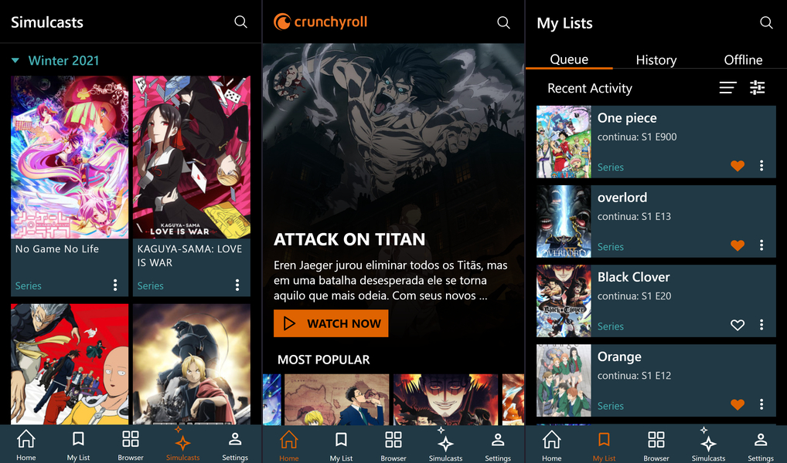

<h1 align="center">UI Clone: Crunchyroll</h1>

<h3 align="center">Crunchyroll mobile interface clone made with React Native 👌</h3>




# Technologies

* [React Navigation](https://reactnavigation.org/)
* [react-native-svg](https://github.com/react-native-svg/react-native-svg)
* [expo/vector-icons](https://docs.expo.io/guides/icons/)
* [expo-linear-gradient](https://docs.expo.io/versions/latest/sdk/linear-gradient/)
* [expo-constants](https://docs.expo.io/versions/latest/sdk/constants/)

# how to use

```
# Clone this repository
    git clone https://github.com/josue-js/clone-crunchyroll-mobile

# Go into the repository
    cd clone-crunchyroll-mobile

# Install dependencies
    yarn install

# Run the app
    yarn start
```